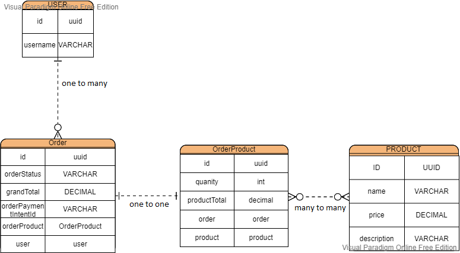

## Introduction

This repo is to demonstrate the usage and implementation of following

- Nestjs
- Nextjs CQRS
- Postgres
- TypeORM
- Stripe
- Stripe webhook
- Docker

## Setup

First clone this repo: 

   ```
   $ git clone https://github.com/kenchoong/nestjs-cqrs.git
   ```

Setup Stripe for our app

1. Download Stripe CLI [here](https://github.com/stripe/stripe-cli/releases/tag/v1.7.9)

2. extract the zip in a local folder example `D:/Desktop/Stripe`

3. Setup Stripe CLI

   ```
   $ cd D:/Desktop/Stripe

   // login to dashboard
   $ stripe login

   // forward the request to our localhost endpoint
   $ stripe listen --forward-to localhost:3002/payment/stripe-webhook

   ```

4. Here you will get a secret(string) in CLI, then paste it in '/backend/.env'

   ```
   STRIPE_WEBHOOK_SECRET="PASTE_SECRET_FROM_CLI"
   ```

5. Test the CLI

   ```
   $ stripe trigger payment_intent.succeeded
   ```

   For info: read [here](https://stripe.com/docs/webhooks)

6. Login in to Stripe and copy the test secret key in Stripe Dashboard

   ```
   End up ur /backend/.env will look like this

   STRIPE_SK_TEST="THE_KEY_FROM_STRIPE_DASHBOARD" <- Get from Stripe Dashboard
   STRIPE_WEBHOOK_SECRET="SECRET_FROM_STRIPE_CLI" <-- get from STRIPE CLI
   ```
   
   > Note: This need to setup the credential probably, if not you will facing this [issue](https://github.com/kenchoong/nestjs-cqrs/issues/6)


   If everything setup probably, you will get the outcome like this in Stripe CLI 
   
   

7. Paste Stripe Publishable key to `frontend/.env` file, to look like this

   ```
   NEXT_PUBLIC_STRIPE_PUBLISHABLE_KEY="PASTE_YOUR_KEY_HERE"
   ```

## Test in localhost

1. Pull Postgres and PgAdmin

   ```
   $ docker-compose -f docker-compose.dev.yml up
   ```

2. Localhost backend

   ```
   $ cd backend
   
   $ yarn

   $ yarn start:dev

   ```

   Now go to http://localhost:3002/api see the Swagger API documentation

3. Localhost Frontend

   ```
   $ cd frontend

   $ yarn
   
   $ yarn dev
   ```

   Go to http://localhost:3000 for frontend

## Database Migration and ERD diagram

Database look like this:



The migration script already setup in `package.json`, so u can run this:

   ```
   $ cd backend

   $ yarn migrate:create [THE_MIGRATION_NAME]

   $ yarn migrate:generate [THE_MIGRATION_NAME]

   $ yarn migrate:run

   // migration file will be in /backend/src/common/db/migrations
   ```

> Note: if in localhost, generate migration having the connect database problem, 

   -  first, need to start the postgres server, if it still exist,
   -  hardcode the host and port in [this file](https://github.com/kenchoong/nestjs-cqrs/blob/b51d59a6d6bd7e0f4427a3cfbd5af4b3dc60c09b/backend/src/common/db/ormconfig.ts#L10), like this:
   
          host: localhost 
          port: 6543

> This only as a temporary solution, and remember change back to `process.env` like in original when build docker image, else later `docker-compose up`, cant connect to postgres

## Some Explaination for the Backend 

Using Domain Domain Design to structure the backend, I try to explain this in Layman Terms below

The app will consists of 5 Layers

1. Defined each functionality into separate module

   Now I have `orders`, `users`, `product`, `payment`, each responsible for each functionality

2. Domain Layer

   AKA The root of each module. For example, `users` module, then here will defined,

   - what properties(data) `a user` will have,
   - validation of the each properties value when insert to db, what a `user` can do will include `AggreateRoot`, `Factory`, `ValueObject` in this layer.
   - will defined in `repo` or `query` interface, to expose the interface for infrastructure and application layer to access the properties of AggreateRoot

3. Application Layer

   Use case. Mostly mean how you want to do with the data, for example `create-user`, `get-product-by-id`, each use-case will in separate folder. Right now is CQRS pattern, so inside it will contain Command, Query, Handler class. Over here is only contain `business logic` aka organize the data using the `domain` before go in infrastructure layer. 

4. Instracture Layer

   The underlying infrastructure needed to support module, like Database, Cache, Messaging, another DB, all this will separate into each individual folder. Right now is just Postgres.

5. Interface layer

   A surface to let real API user to hit on. Controller and Data Transfer Object for request and response.Basically the data flow like this, below.

    ```
    // --> Data in:
    interface -> application -> domain -> infrastructure(Entity)

    // <-- Data out:
    interface <- application <- domain <- infrastructure(Entity)

    ```
 6. Event layer (only when needed)

      Example, received event from Stripe, then need to update the `orderStatus` in `order` module. To separate this, we use event. Payment module trigger an event, Order module receive it, will update the db. 

      You can see the flow start from [here](https://github.com/kenchoong/nestjs-cqrs/blob/9337341d8fa65aab6306d41fad3b04050fef1733/backend/src/payment/application/process-stripe-webhook/process-webhook.handler.ts#L48)

## Deployment

    In root folder

    $  docker-compose -f docker-compose.yml up --build

Let the image build, this will take estimate 500 seconds to initialize `backend`, `frontend`, `postgres`, and `pgadmin`

1. See the outcome

   [localhost:3000](http://localhost:3000/) Nextjs app

   [localhost:3002/api](http://localhost:3000/api) Swagger Documentation

   [localhost:5555](http://localhost:5555) pgadmin

- login using `POSTGRES_USER` and `POSTGRES_PASSWORD` defined in `/backend/.env`

   connect to server using value of `hostname = POSTGRES_HOSTNAME` ,`port = 5432`
   `POSTGRES_USER` and `POSTGRES_PASSWORD` as well

# Summary

In this project, mainly to showcase the Domain Driven Design for the backend. If problem, open the issue. Cant make a `1 command setup` because need to build Stripe credential inside the docker.
